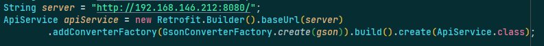

## Sweet Home
<div align="center">

<br/>
</div>

## What is Sweet Home?

Sweet Home is a system that helps you to control devices of your smart homes.

## What is this repo?

This repo is mobile app of Sweet Home with three main functions: sign in, control device, adjust parameters.
<br/>
<div align="center">

</div>
<br/>

## Implementation

- Clone sweethome mobile app by command:
```bash
git clone https://github.com/Lindis0804/sweethome_mobile_app
```
- Run [sweethome server](https://github.com/Lindis0804/sweethome_backend).
- Open sweethome mobile app by Android Studio.
- Because you are running sweethome server locally, make sure your mobile device and your sweethome server (in most case your server is your computer) are on the same LAN (for example they connect to the same wifi,...) and you have to config server address (in this case, server address is your computer's ip address) in app/java/com.ldh.smarthouse/API/ApiService:
```bash
String server = "http://<YOUR_SWEETHOME_SERVER_ADDRESS>:8080/";
```
For example:
<br/>
<div align="center" >

</div>


## Result:

||||
|-----------------------------------------------------|-----------------------------------------------------|-----------------------------------------------------|
|<div align="center">Login</div>|<div align="center">House List</div>|<div align="center">Room and Device List</div>|