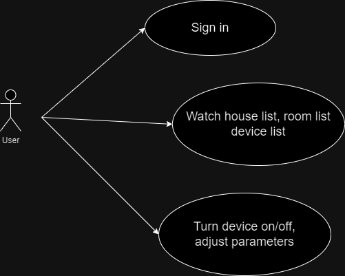
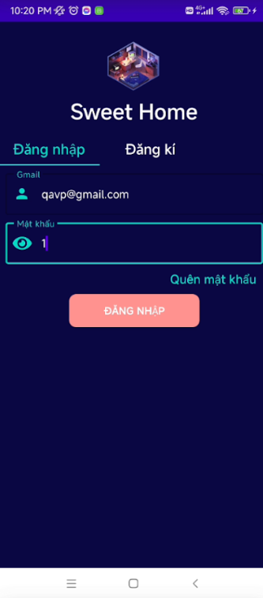
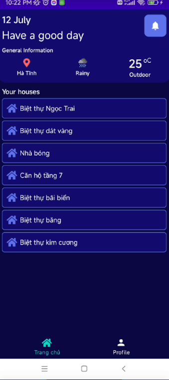
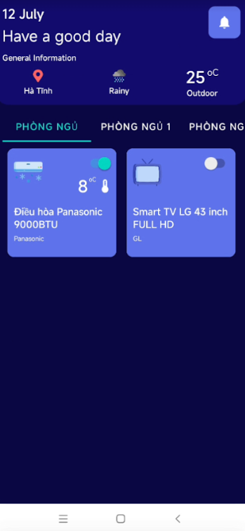

## Sweet Home
<div align="center">

<br/>
</div>

## What is Sweet Home?

Sweet Home is a system that helps you to control devices of your smart homes.

## What is this repo?

This repo is mobile app of Sweet Home with three main functions: sign in, control device, adjust parameters.
<br/>
<div align="center">

</div>
<br/>

## Run app

- Clone app by command:
```bash
git clone https://github.com/Lindis0804/sweethome_mobile_app
```

- Open and run by Android Studio.

## Result:

||||
|-----------------------------------------------------|-----------------------------------------------------|-----------------------------------------------------|
|Login|House List|Room and Device List|